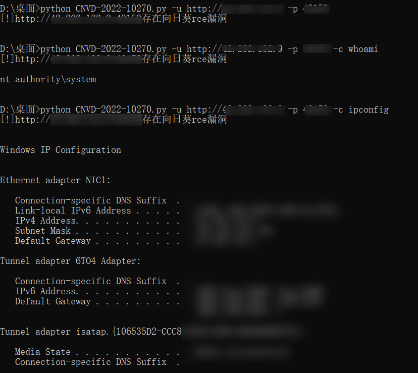

# CNVD-2022-10270
用法

```
# 验证漏洞
python CNVD-2022-10270.py -u {ip} -p {port}
# 漏洞利用
python CNVD-2022-10270.py -u {ip} -p {port} -c {cmd}
# 批量验证
python CNVD-2022-10270.py -l {a.txt}

#ip前面需要加上协议
#批量验证格式：http://ip:port
```

实例


